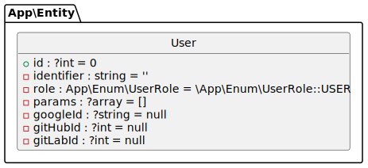

# Symfony Playground "two"


## What's this??
An opinionated [Symfony](https://symfony.com) project template including:

* Symfony 8.*
* Docker compose file for PostgreSQL
* `dev` login form <br/> `prod` Social login with Google, GitLab, GitHub and [more](https://github.com/knpuniversity/oauth2-client-bundle#step-1-download-the-client-library)
* A user CRUD interface
* Bootstrap

## Installation
Clone the repo then use the
```shell
bin/install
```
command OR execute the script content manually.
   
## Usage
Create and administer user accounts.
```shell
symfony console user-admin
```
Start and stop the environment.
```shell
bin/start
```
```shell
bin/stop
```


## Testing

```shell
make tests
```

## Check for updated
Check four outdated PHP deps, recipes and assets.

```shell
composer check
```

## Database



You can create this with 

```shell
composer db-diagram
```

----

Happy coding `=;)`
